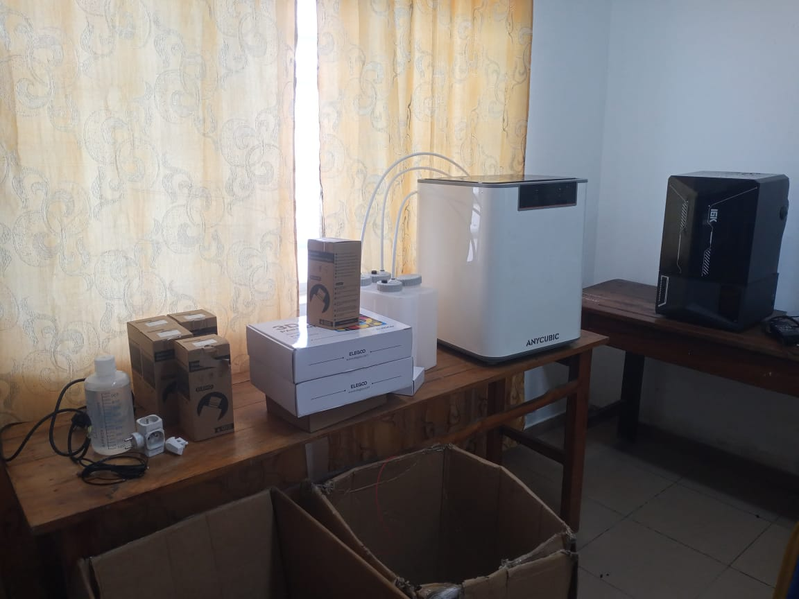
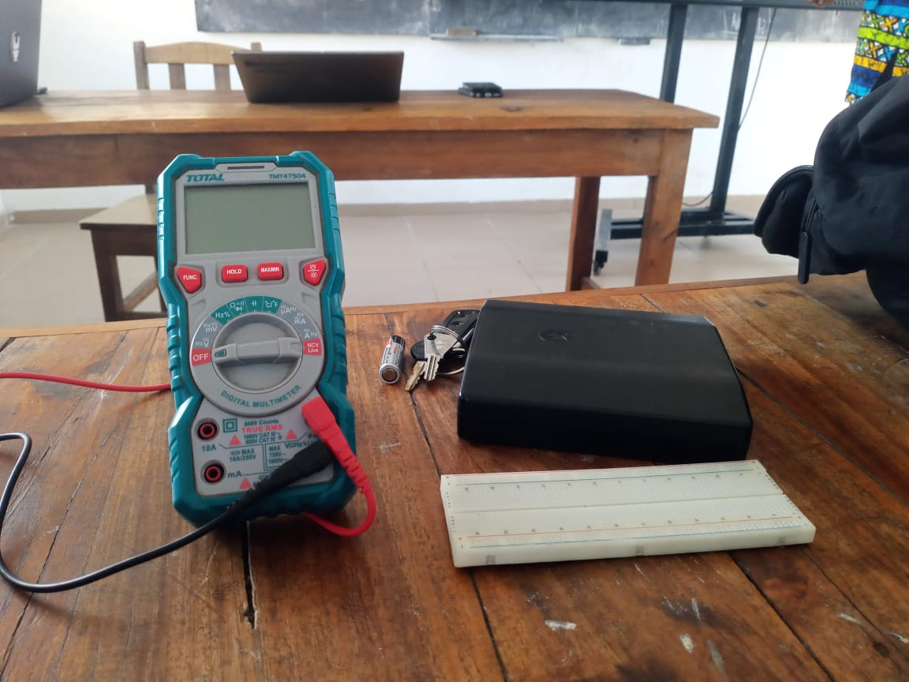
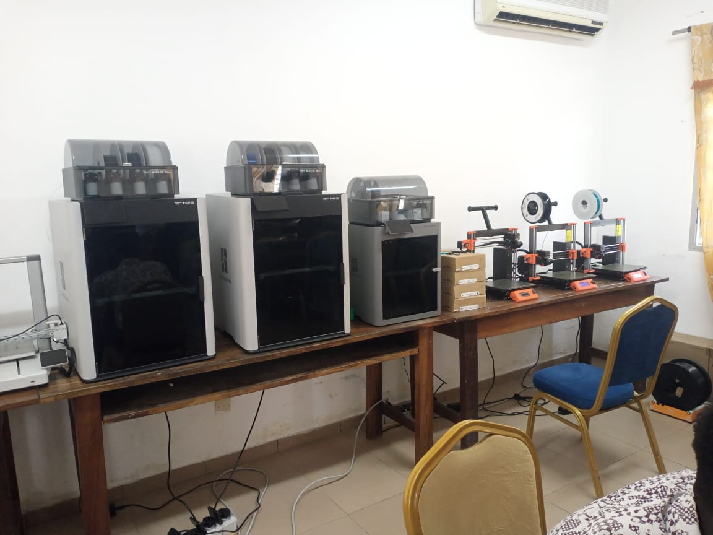
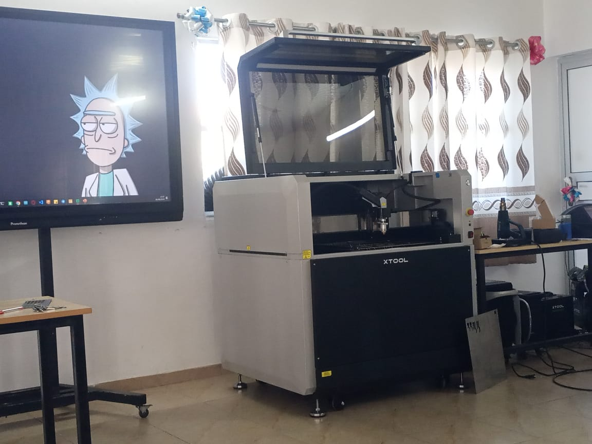

# Journal du 26 aout 2026 (Rediger par : GNANZA Moussa)

## Fait aujourd'huit
- Formation de groupe de 25 et groupe de 4 persones
### Atelier d'electronique
- cours sur les bases en électronique
- Quelques grandeur physiques
### Atelier de imprimante 3D
- Rappel sur les principeq generaux à l'impression 3D
- Les grandes famille de l'imprimente 3D
- Historique sur l'impression 3D
- Trois logique de fabrication

### Atelier de Projet 
- Discussion sur les differents projets
- Les defits
- L'anato,ie du programme à enseigner 
### Atelier de decoupe laser
- Généralité sur decoupe laser
- Les differents type de decoupe laser
## appris
### Atelier d'electronique
- Mesure de la resistance
- calcule de la valeur de la resistance a parir des coes de couleur

### Atelier de imprimante 3D
- Il ya des sites qui sont specialiséés pour les imqges 3D 
- Définition de la fabrication additive
- Les differents types de filament

### Atelier de Projet
- J'ai appris à reflichire sur les projets (avoir un lecteur d'emprunte)
- On appris qu'il faut partir du prblème à la solution 
### Atelier de decoupe laser
- J'ai connu les differents types de decoupe laser
- instalé le logiciel xtool
- Parametré avec xtool
- Comment fqire une decoupe.

 ## Echec , décidé
 - Ploblème de connexion
 - Il n'ya assez de machine
 

