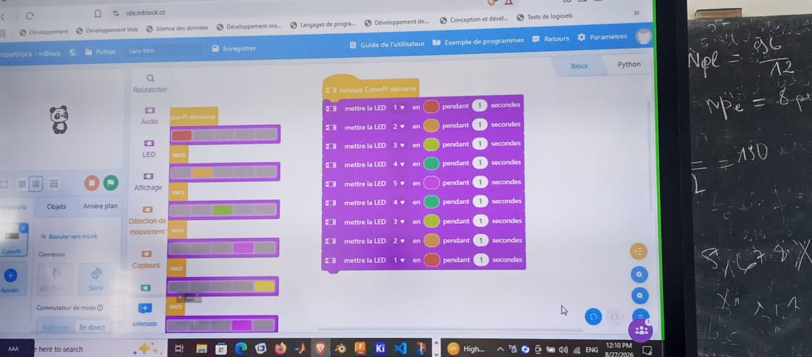
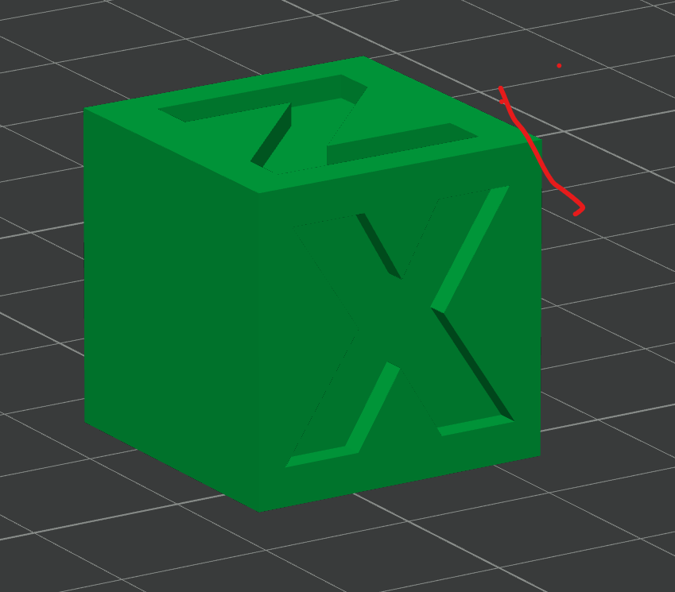
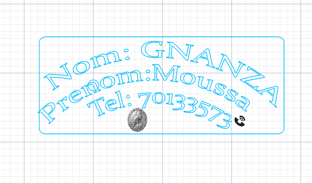

# Journal du 27 août 2026 (Rediger par : GNANZA Moussa)

## Fait aujourd'huit
- Control de presence et chaque groupe de 25 persones est alle dans son attelier
### Atelier d'electronique
- Revision du cours sur l'electronique
- programmation en electronique
### Atelier de imprimante 3D
-  rappel sur les principes de l'impression 3D
- istalation du logiciel bambustudio 
- comment passer de l'image a l'objet
### Atelier de Projet 
- istalation du logiciel Fusion client 
### Atelier de decoupe laser
- istalation du logiciel xtool 
- decouper une carte visite
## appris
### Atelier d'electronique
- Programmer un code de couleur

### Atelier de imprimante 3D
- parametrer  les imqges 3D 
- Importer une image 3D
- Imprimr une image 3D 
- 
### Atelier de Projet
- le logiciel fusion client 
### Atelier de decoupe laser
- faire un projet
- faire la coupe d'une carte de visite
- 
 ## Echec , décidé
 - Ploblème de connexion
 - Il n'ya assez de machine
 