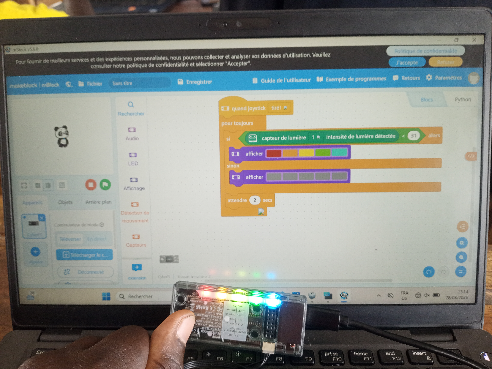

# Journal du 28 août 2026 (Rediger par : GNANZA Moussa)

## Fait aujourd'huit
- Controle de presence et chaque groupe de 25 persones est alle dans son attelier
### Atelier d'electronique
- programmation en electronique avec un capteur de lumiere
### Atelier de imprimante 3D
- copier le fichier 
- faire le parametrae 
- imprimer le fichier
### Atelier de Projet 
- istalation du logiciel Fusion client 
- cours sur design thinking
### Atelier de decoupe laser 
- decouper une carte visite
## appris
### Atelier d'electronique
- Programmer un capteur de lumiere

### Atelier de imprimante 3D
- parametrer  les imqges 3D 
- Importer une image 3D
- Imprimer une image 3D 
- 
- 
### Atelier de Projet
- le logiciel fusion client 
### Atelier de decoupe laser
- faire la coupe d'une carte de visite
- 
 ## Echec , décidé
 
 