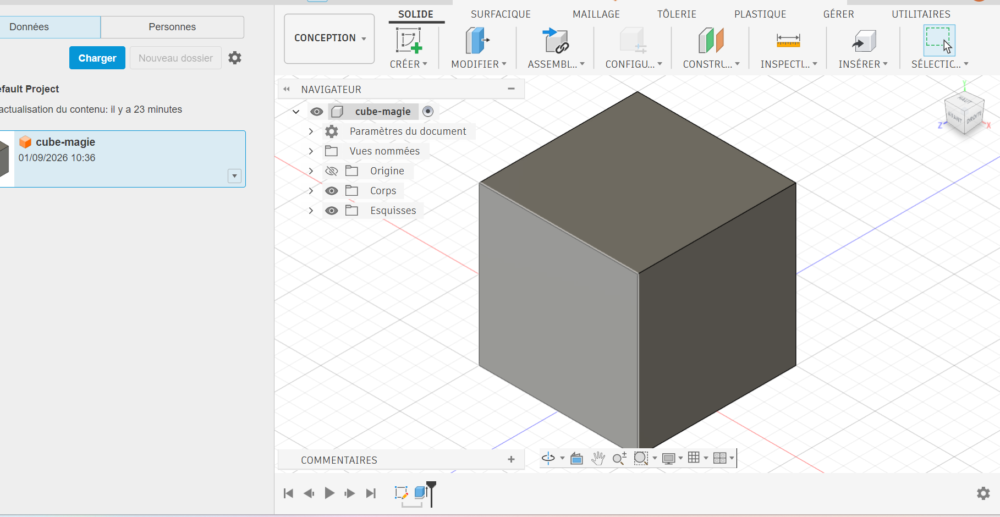

# Journal du 31 août 2026 (Rediger par : GNANZA Moussa)

## Fait aujourd'huit
- Controle de presence et chaque groupe de 25 persones est alle dans son attelier
- Reflexion sur les projets
- choix du materiel
- cahier de charge
- cours sur fusion
- dessin technique
## appris
- j'ai appris à faire les projections en dessin technique
- à faire une esquisse
- à transformer une esquisse en solide

- à remplire le cahier de charge

 ## Echec , décidé
 
 