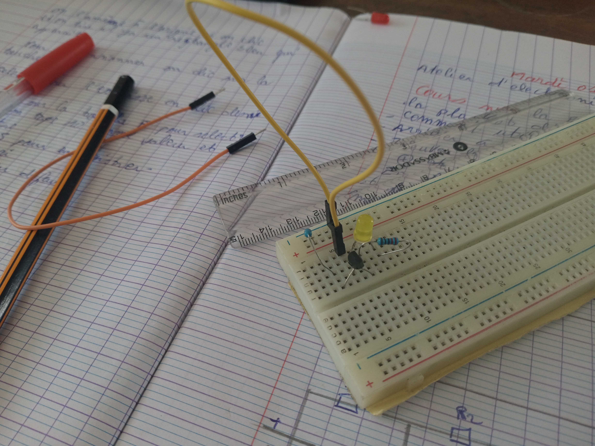
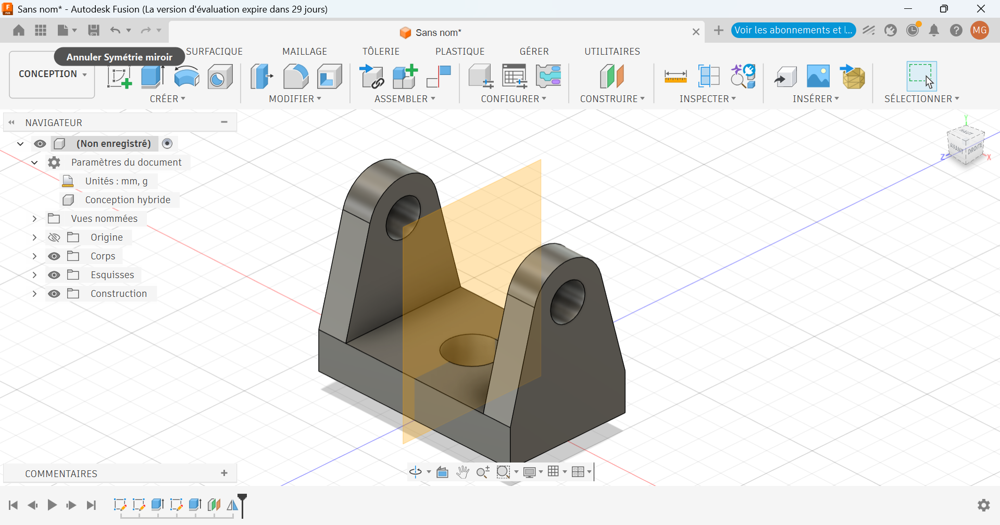
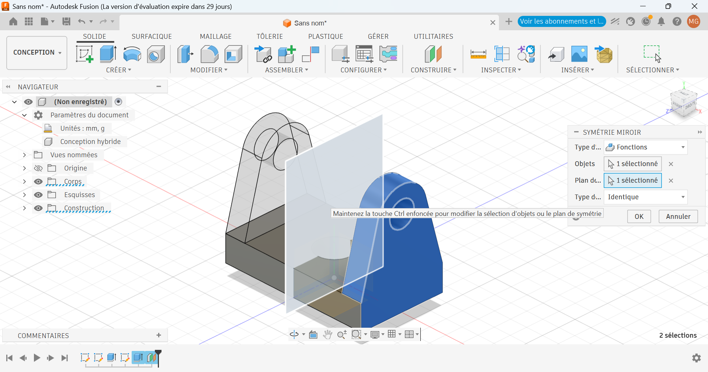
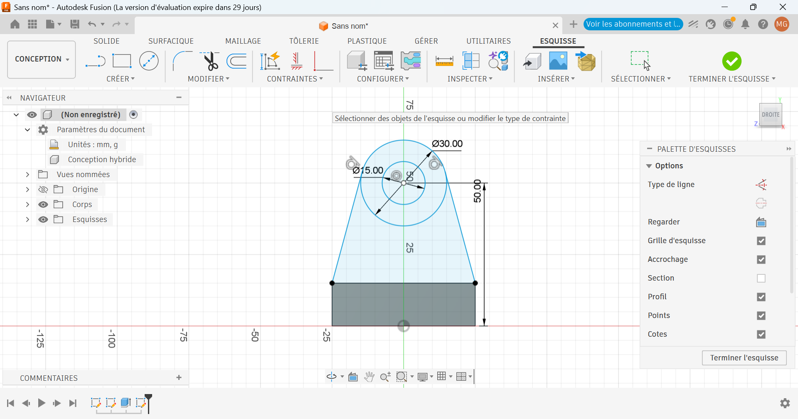
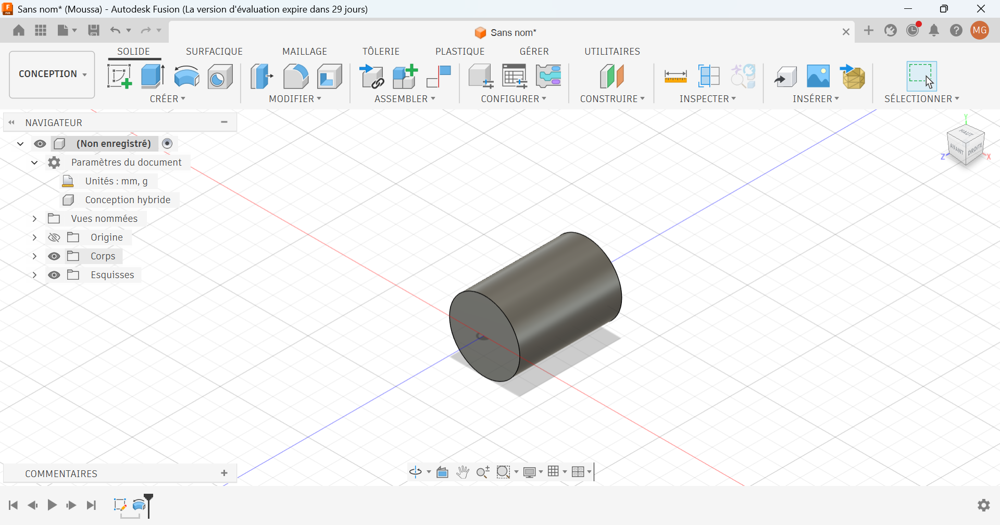

# Journal du 01 septembre 2026 (Rediger par : GNANZA Moussa)

## Fait aujourd'huit
- Controle de presence et chaque groupe de 25 persones est alle dans son attelier
- cours sur Breadboard SK10
- impression DTF
- modelisation en 3D
## appris
- à reaisé un montage sur la plaque d'essai

- à faire une esquisse
- à transformer une esquisse en solide

- à faire une impression DTF

 ## Echec , décidé
 - dificulté à faire la symetrie avec le miroir
 - Refaire à la maison
 - Faire beaucoup d'exercice à la maison