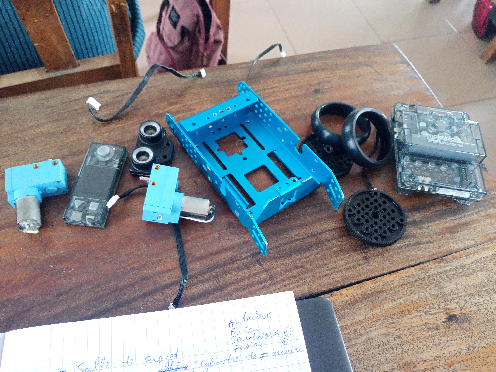
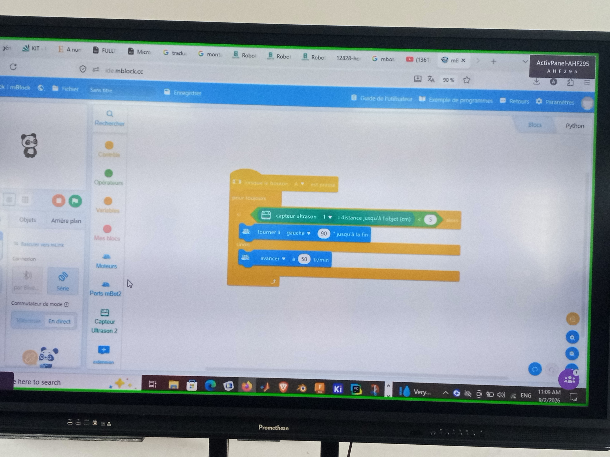
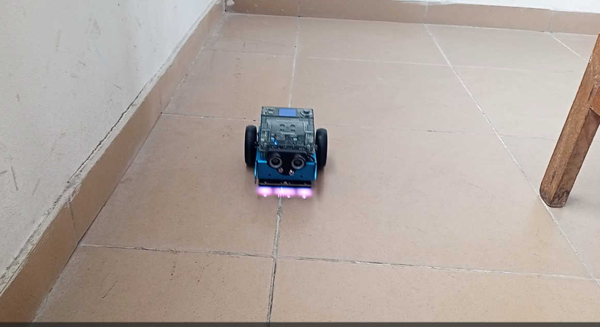
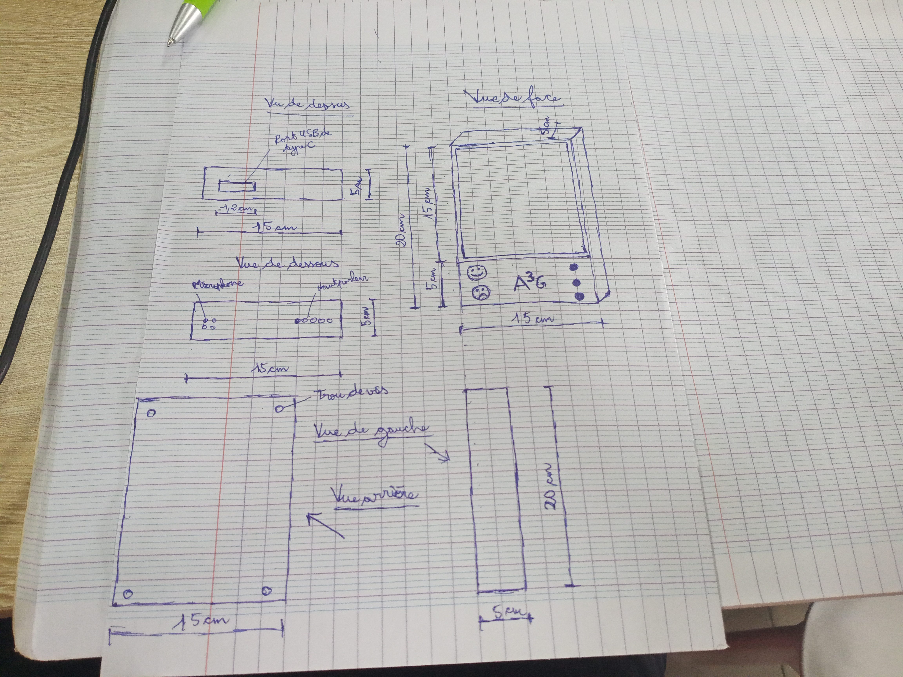
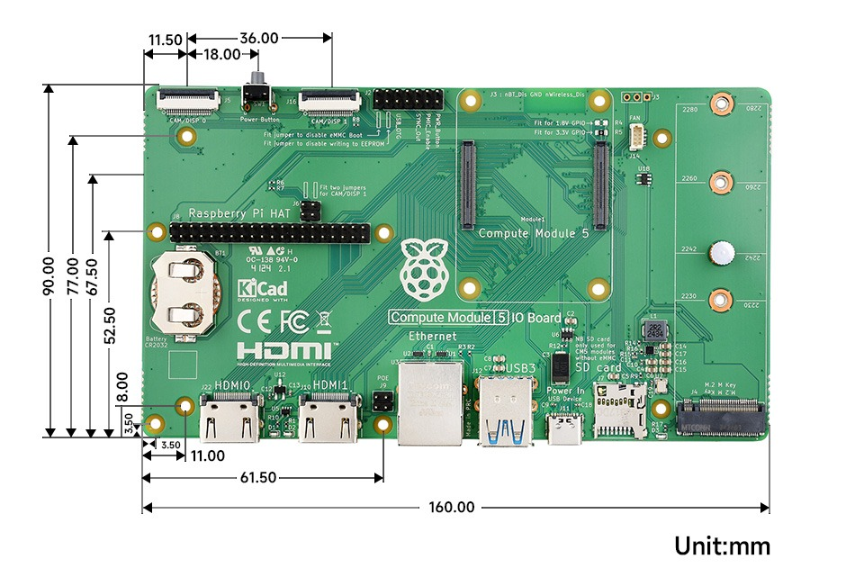
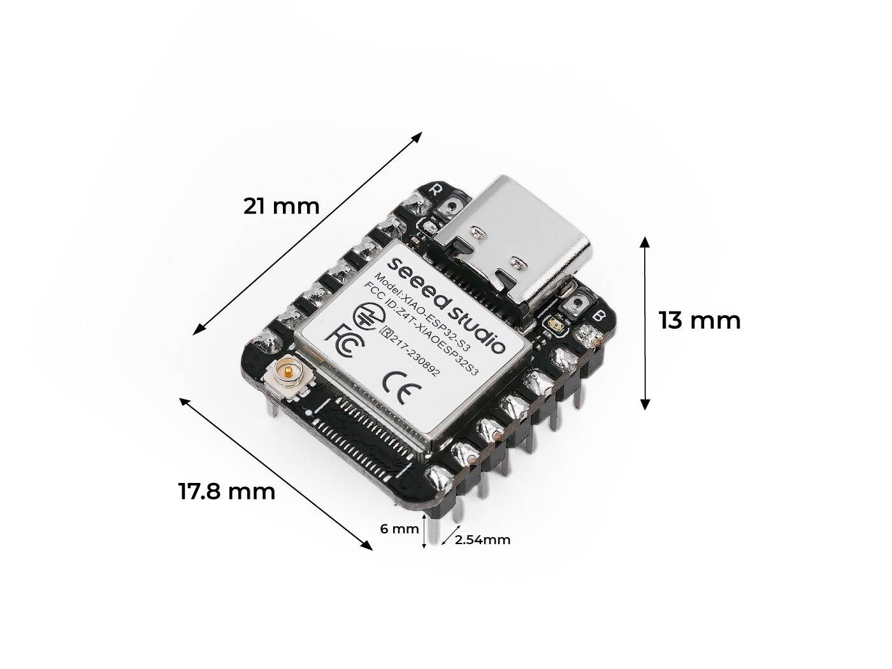
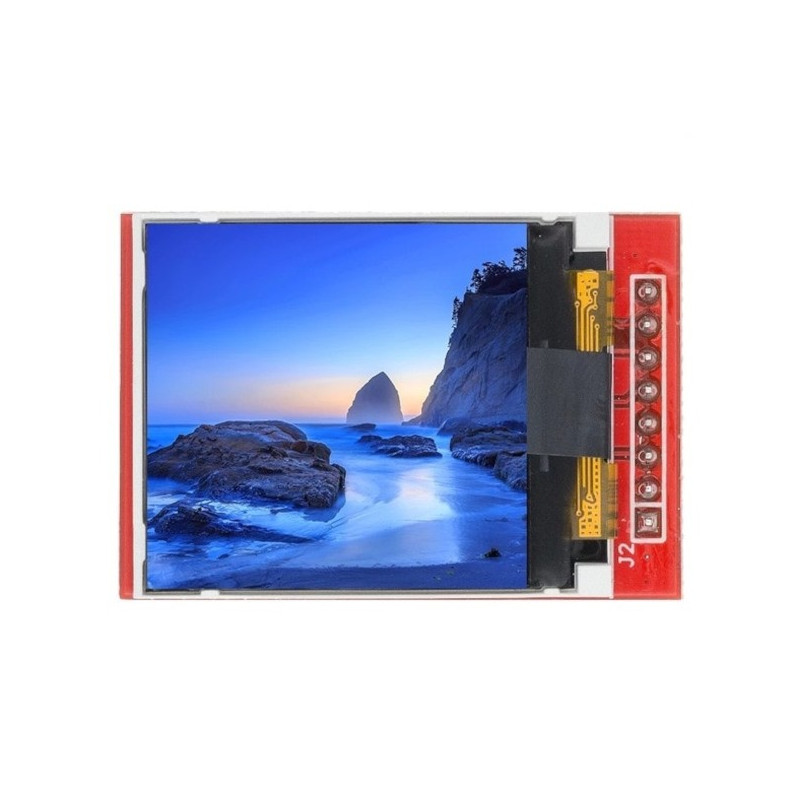
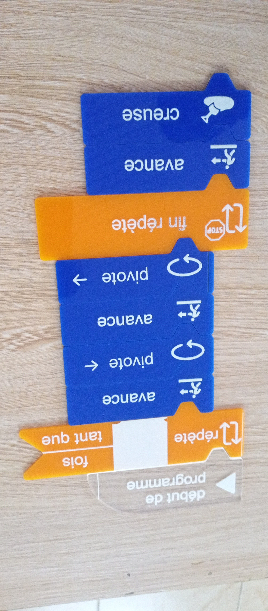

# Journal du 02 septembre 2026 (Rediger par : GNANZA Moussa)

## Fait aujourd'huit
- Controle de presence et chaque groupe de 25 persones est alle dans son attelier
- creer un robot mbot2
- cours sur algorythme
- discussion sur le projet
## appris
- à assembler un robot

- à programer un robot

- recherche de pile, d'ecran; ESP32; la placket a utiliser pour notre projet

- histoire de l'algorithme

- recherche de pile, d'ecran; ESP32; la placket a utiliser pour notre projet

 ## Echec , décidé
 - dificulté à faire la symetrie avec le miroir
 - Refaire à la maison
 - Faire beaucoup d'exercice à la maison