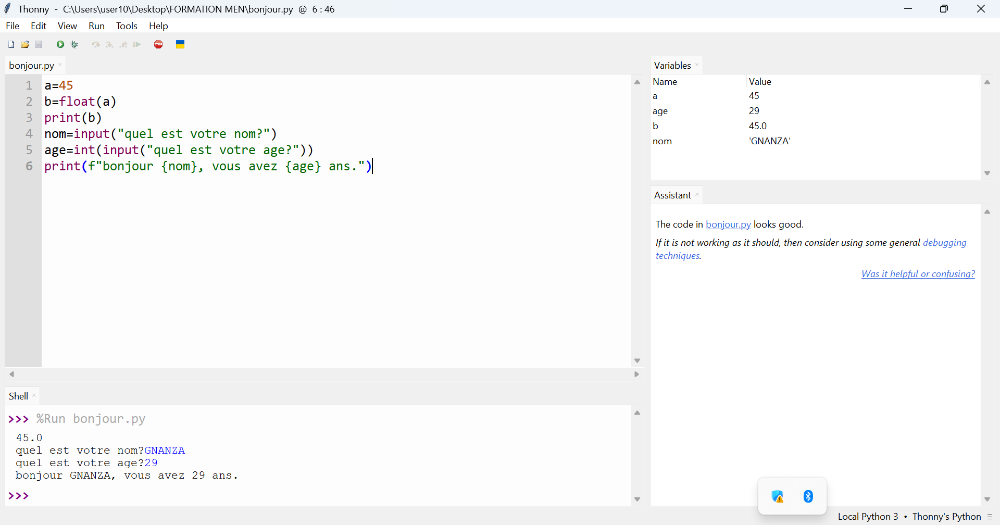
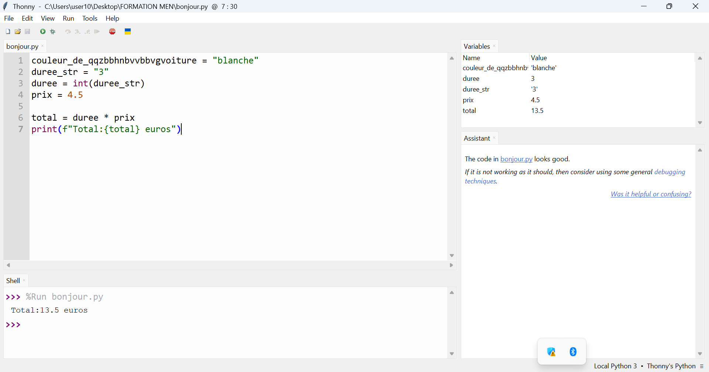

 # Journal du 03 septembre 2026 (Rediger par : GNANZA Moussa)

## Fait aujourd'huit
- Controle de presence et chaque groupe de 25 persones est alle dans son attelier
- cours sur programmation en python
- discussion sur le projet
## appris
- les bases en python
- crire un programme 

- à convertire les types et affichage avec f-string
- à utiliser la fonction input
- liste finale pour notre projet
- faire des recheres sur le type d'ecran à utiisé; l'IA qu'il faut integré; les types de haut parleurs; de microphone

 ## Echec , décidé
 - Refaire des exercices à la maison
 - faire la modelisation à la maison
 - realisé le circuit et écrire le programme de l'IA
 