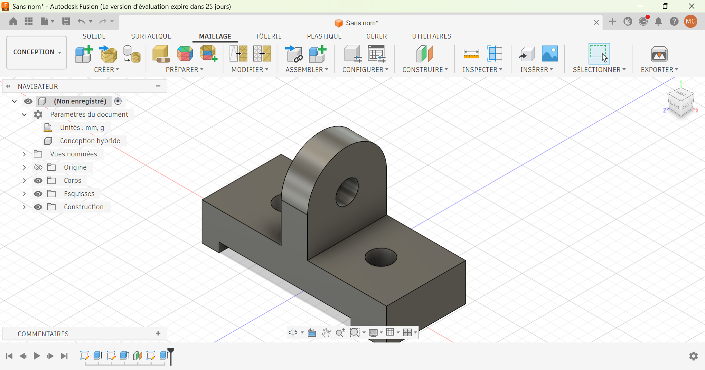

# Journal du 04 septembre 2026 (Rediger par : GNANZA Moussa)

## Fait aujourd'huit
- Controle de presence 
- cours sur programmation en python suite
- cours sur le PCB
## appris
- utiliser les conditions: if;elif;else pour ecrire un programme
- utiliser la boucle for

- à convertire les types et affichage avec f-string
- à utiliser la fonction input
- faire une modelisation avec fusion

- les differente methode de fabrication d'une placket
- parametrer une placket en cuivre pour faire une gravure

 ## Echec , décidé
 - Refaire des exercices à la maison sur programmation en python
 - faire la modelisation à la maison 
 - 
 