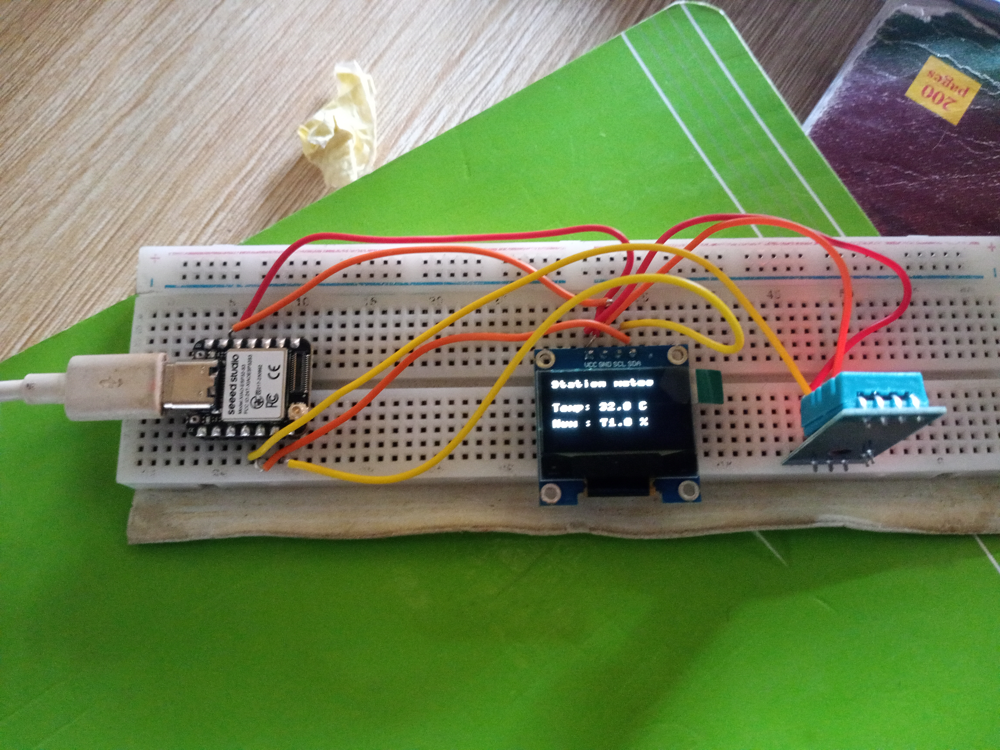

# Journal du 05 septembre 2026 (Rediger par : GNANZA Moussa)

## Fait aujourd'huit
- Controle de presence 
- se regrouper par groupe de 4
- programmer une station meteo en utiisant e micro-python pour programmer
## appris
- Realiser une station météo

- connecter l'ecran oled, capteur de tamperature et d'humidité avec le ESP3
- copier un programme sur le logiciel micro-python
- scaner le code sur ESP32

 ## Echec , décidé

