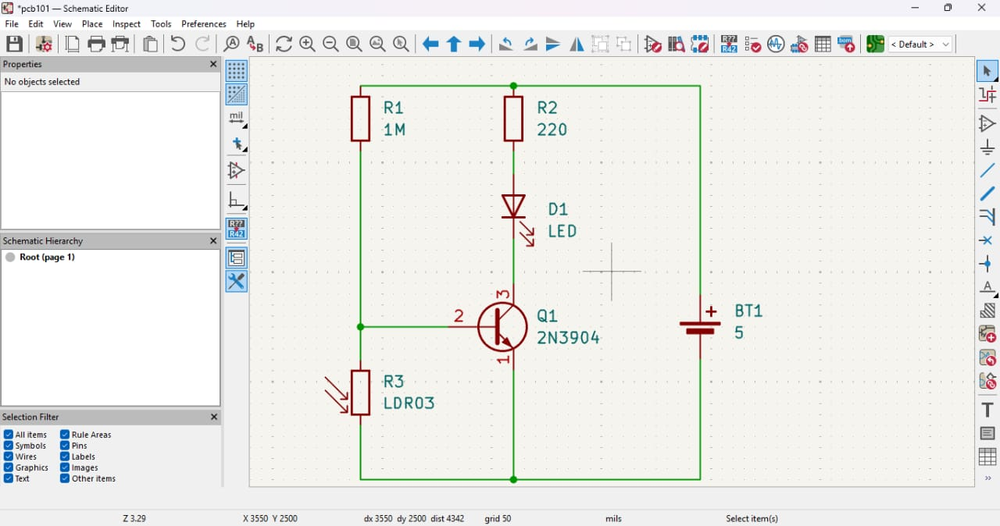
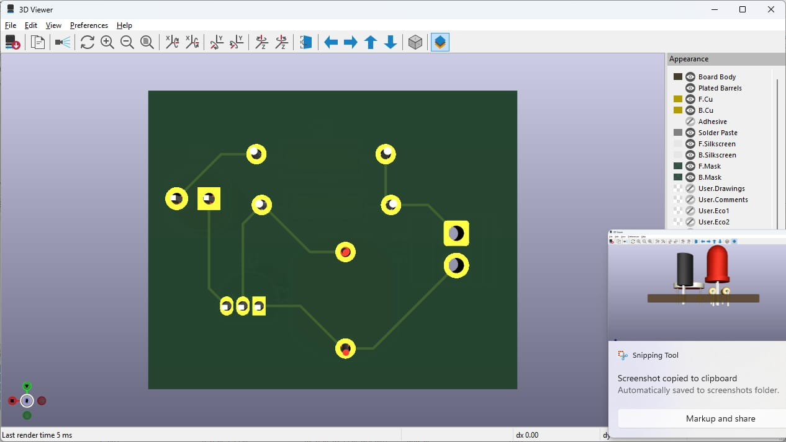
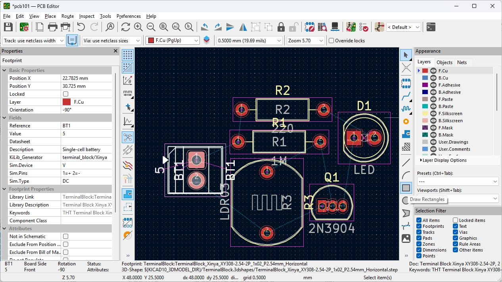
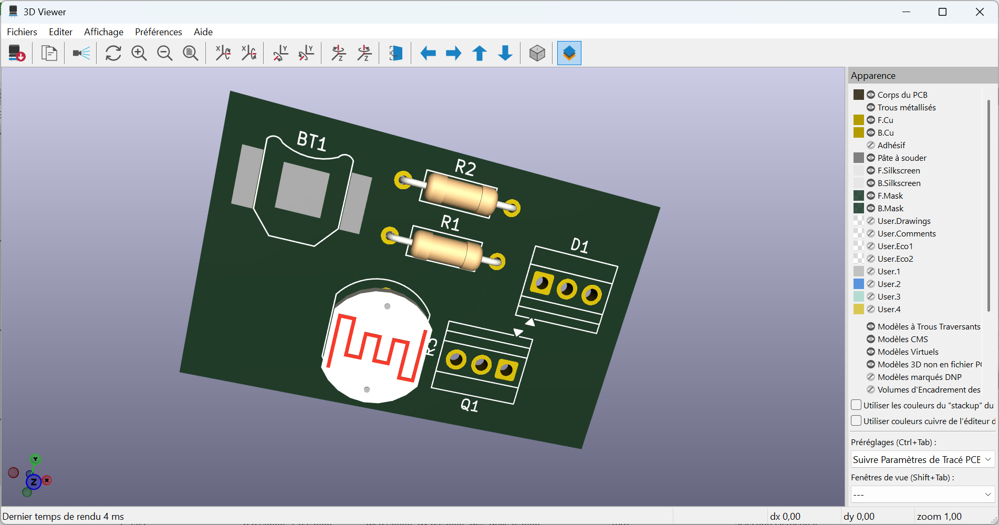

# Journal du 07 septembre 2026 (Redigé par : GNANZA Moussa)

## Fait aujourd'huit
- Contrôle de présence 
- Discussion avec le formateur principal sur nos peurs, les difficultés que nous avons .
- cours sur PCB .
- instalation du logiciel kicad

## appris
- PCB= printed circuit board
- avantages du PCB: reduction de lqa taille et du cablage, cnnexions solide et répetable, meileur résistance  aux vibrations
- les elements essentiels du PCB: cuivre; solder mask; substrat
- faire un circuit sur kicad

 
 
 

 ## Echec , décidé
 - dificulté à faire corectement une plackette PCB
 - Faire des exercices à la maison.

