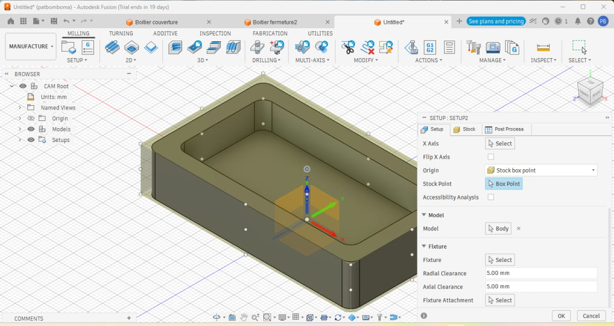
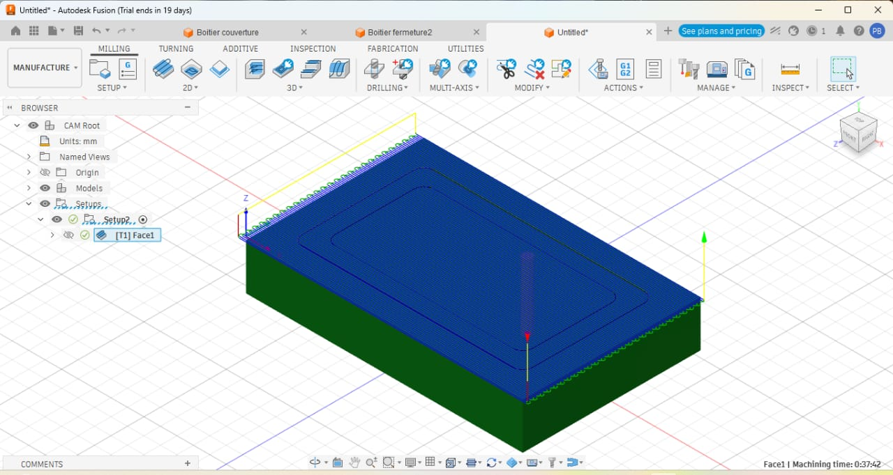
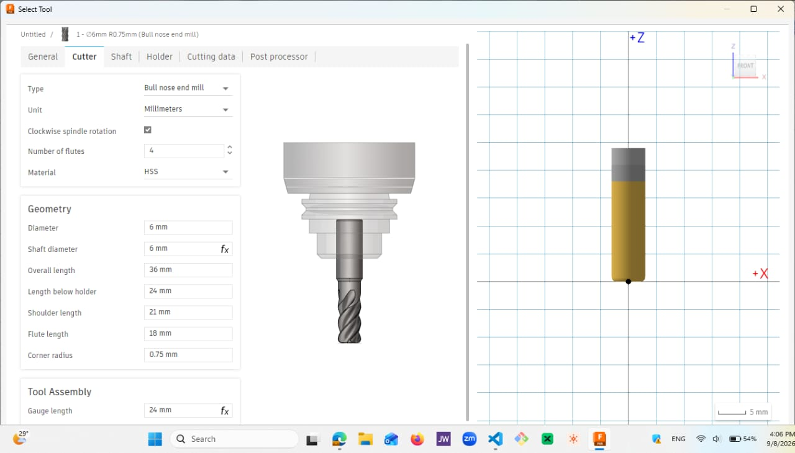
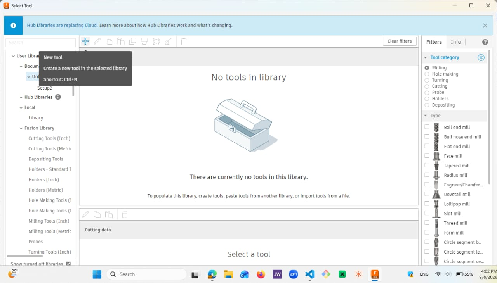
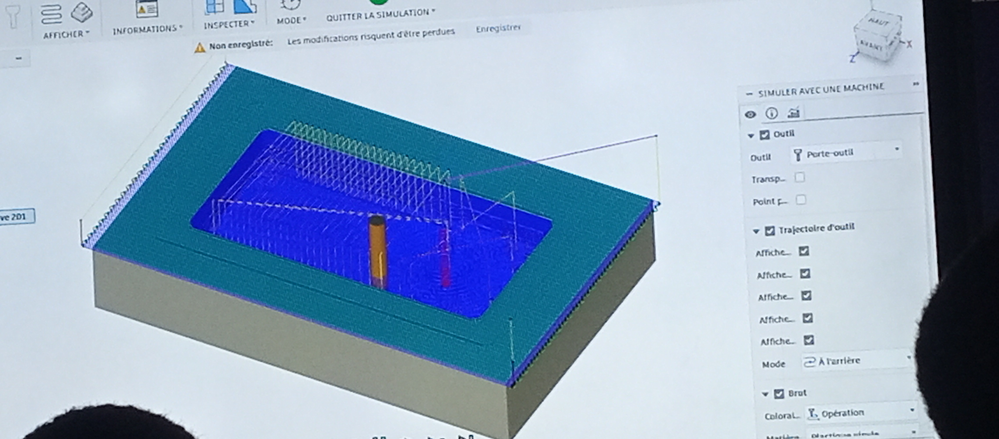
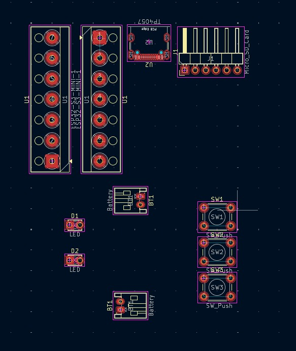
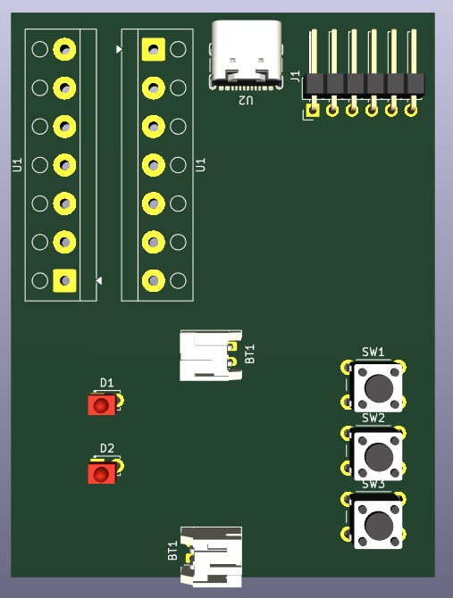

# Journal du 08 septembre 2026 (Rediger par : GNANZA Moussa)

## Fait aujourd'huit
- Controle de presence 
-  faire deux groupes
- cours sur la FAO
- travailler sur ntre projet
## appris
- Definition de la FAO, CNC
- faire une modelisation avec la FAO

- écrire un programme pour la reconnaissance vocale; detecté les mots mal lu

- conception de plackete PCB pour le projet

 ## Echec , décidé