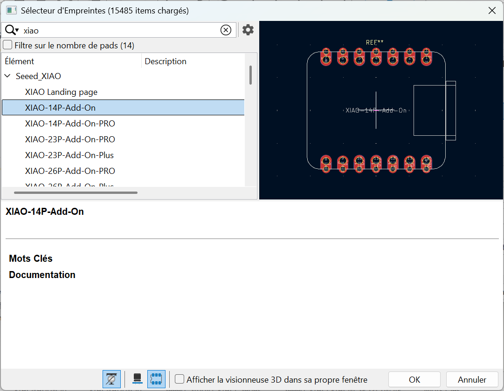
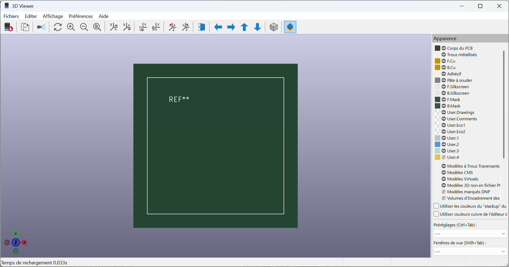
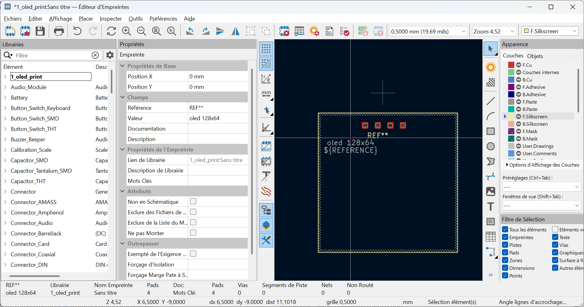
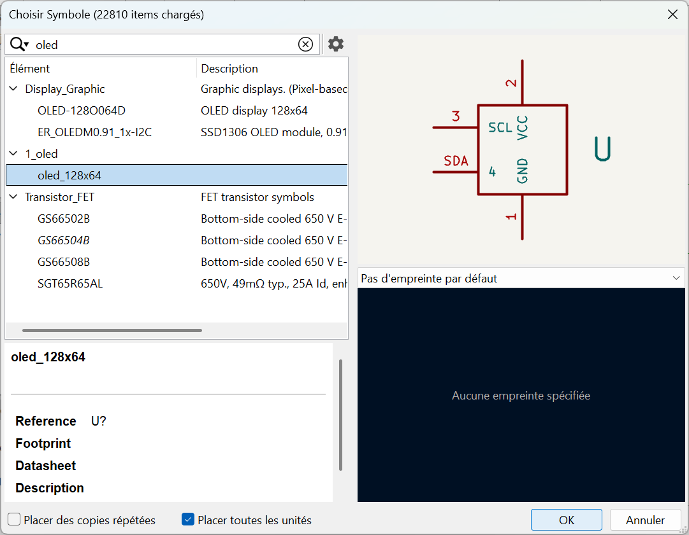
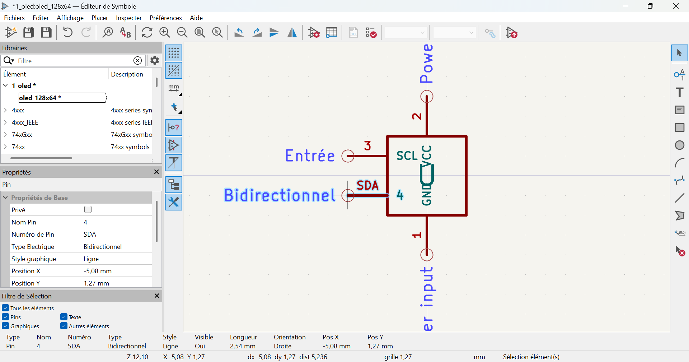
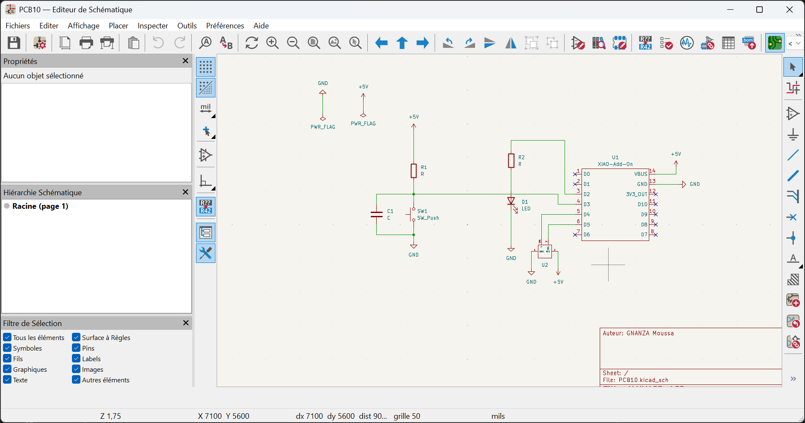
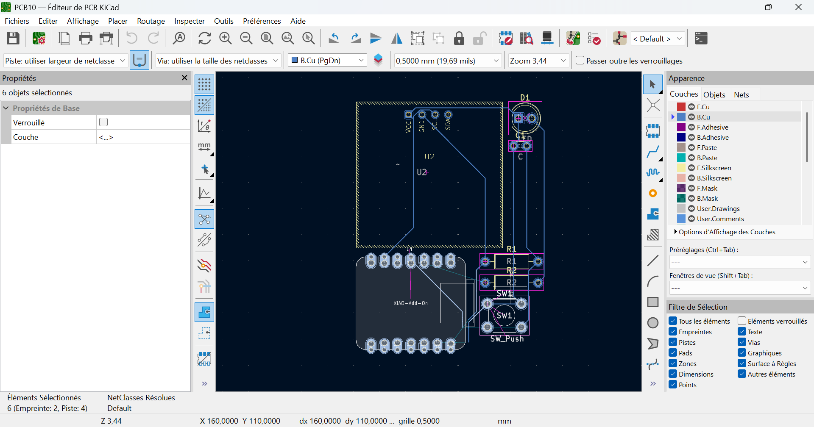
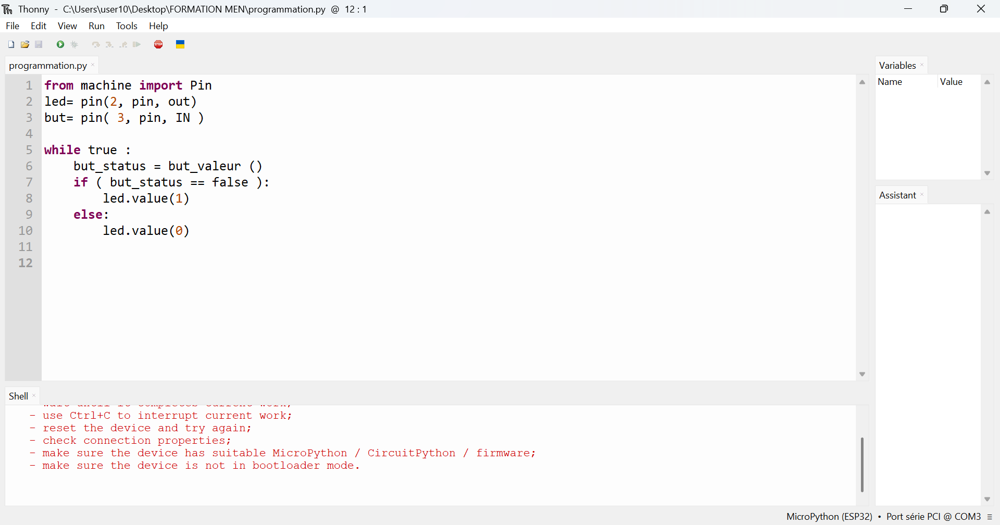

# Journal du 09 septembre 2026 (Rediger par : GNANZA Moussa)

## Fait aujourd'huit
- Controle de presence 
- faire une plackette PCB
- Cours sur programmation
## appris
- fabrication d'une plaquette PCB
- Creer les composants electriques et importer des librairy avec kicad
- 

- ecrire un programme dans tonny

 ## Echec , décidé
 - difficulté à faire corectement les connexions entre les composants
 - Je vais repprendre à la maison pour mieux maitriser  