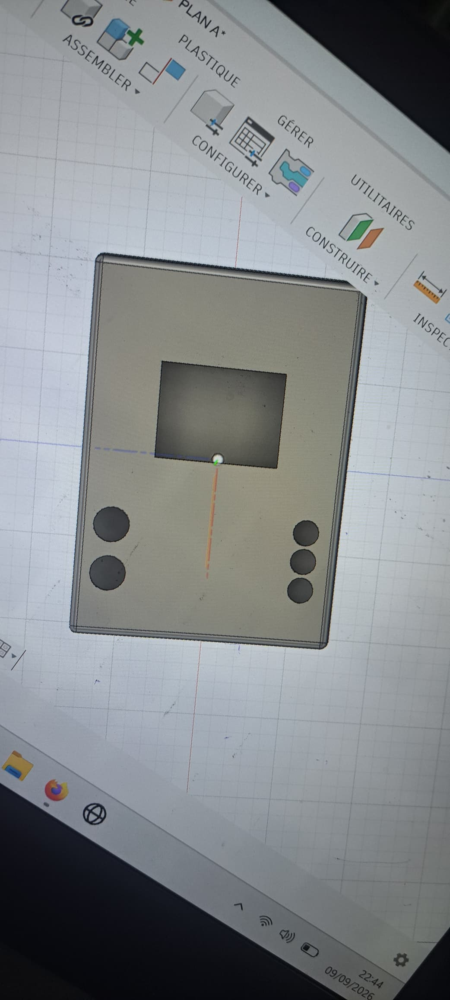
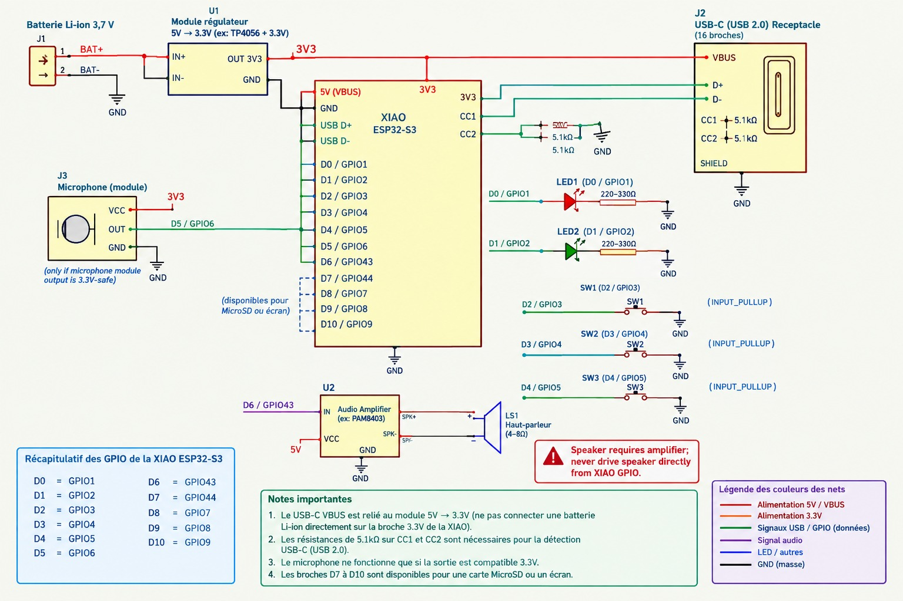
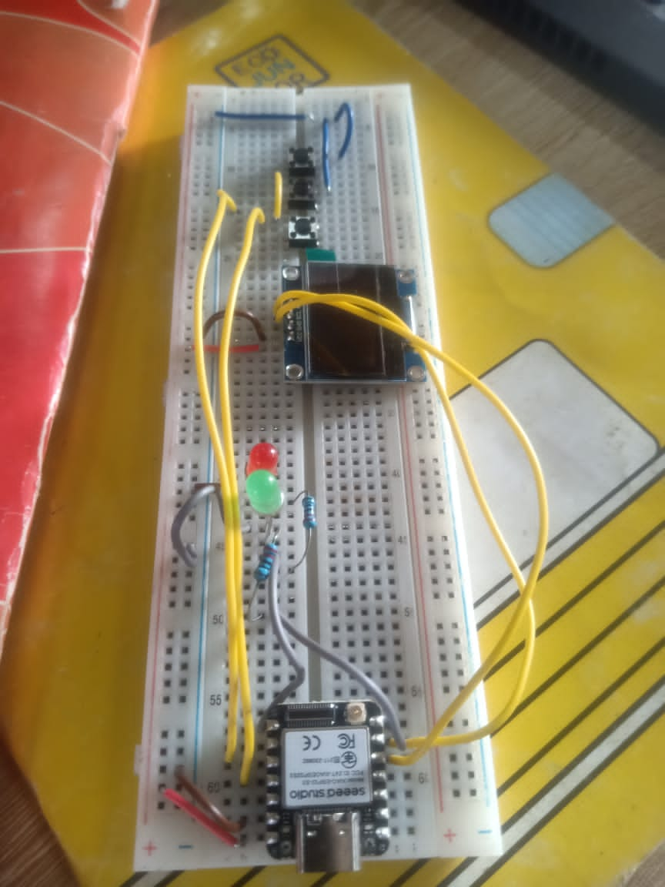

# Journal du 10 septembre 2026 (Rediger par : GNANZA Moussa)

## Fait aujourd'huit
- Controle de presence 
- se regroupé en groupe pour continuer les projets
## appris
- faire la Modelisation du boitier 

- Faire la plaquette PCB

- faire un circuit sur la plaquette SK10

- ecrire le programme (code texte)

 ## Echec , décidé
 