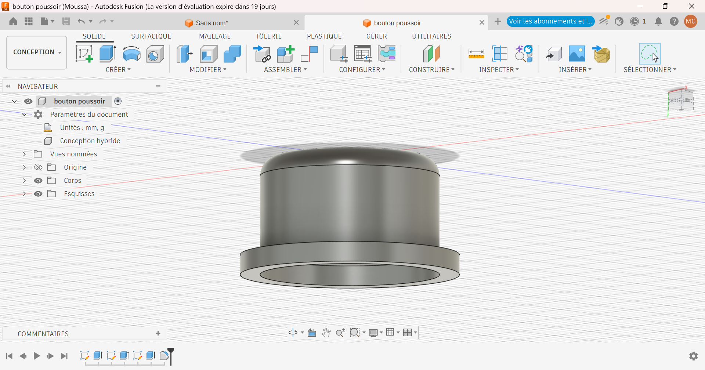
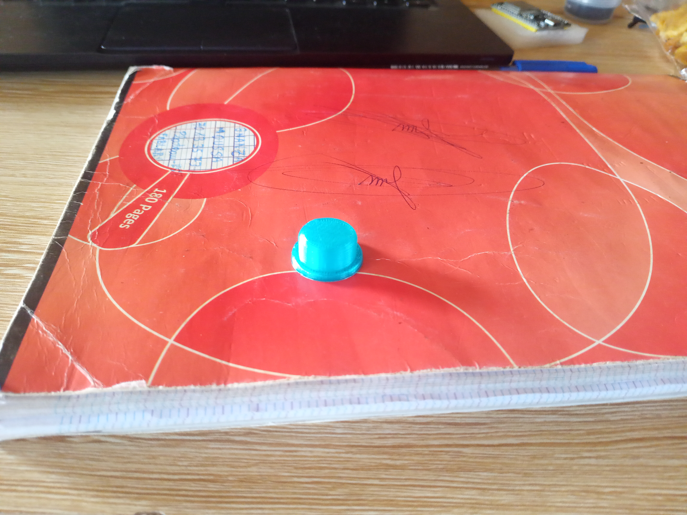
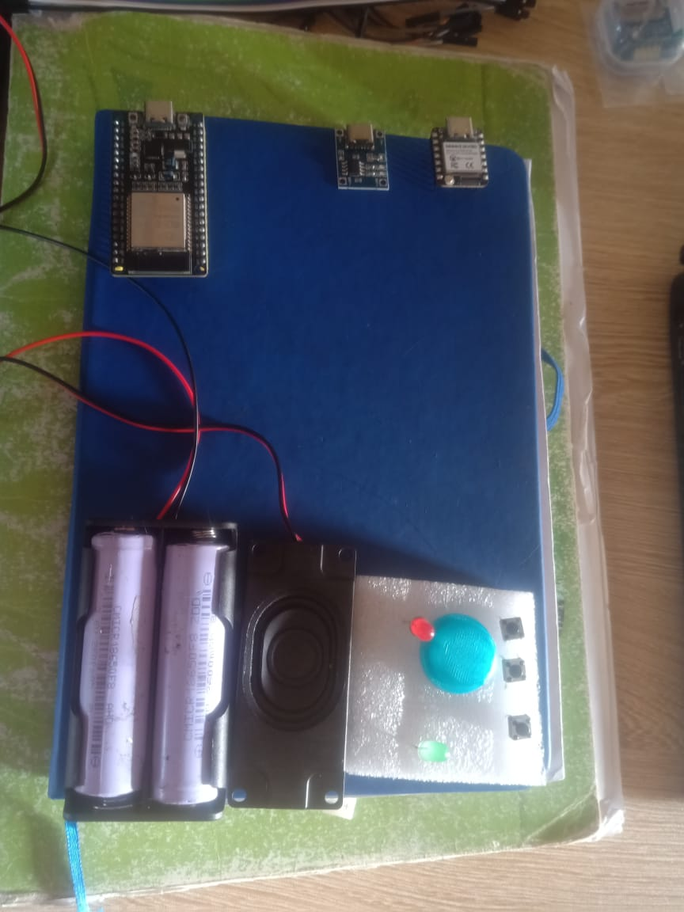

# Journal du 11 septembre 2026 (Rediger par : GNANZA Moussa)

## Fait aujourd'huit
- Controle de presence 
- se regroupé en groupe pour continuer le projet sous la suppervision des formateurs.
## appris
- faire  des retouches sur la Modelisation du boitier 
- faire la Modelisation du couvre bouton poussoir 
- imprimer le couvre bouton poussoir

- un exemple d'apperçu du cicuit imprimé

 ## Echec , décidé
 