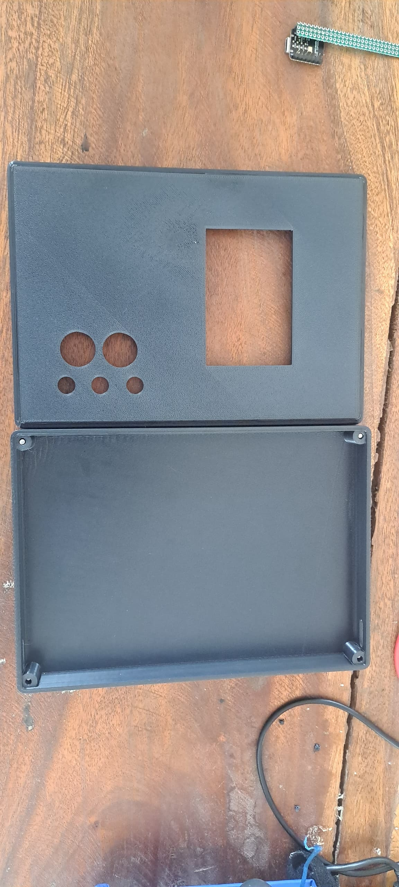
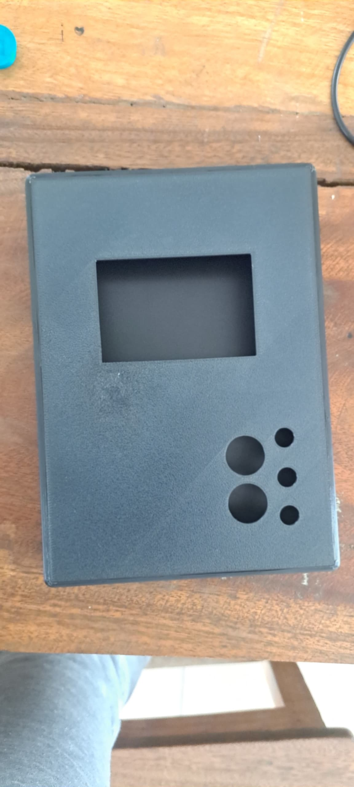
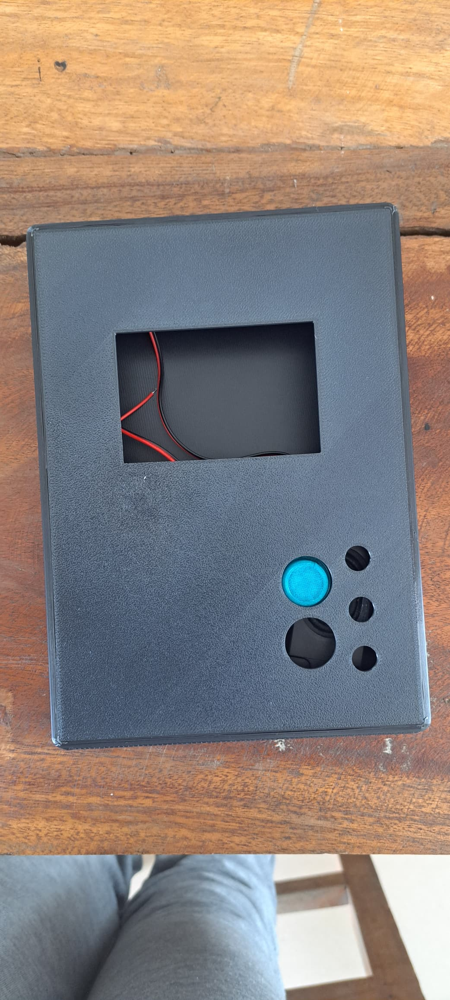
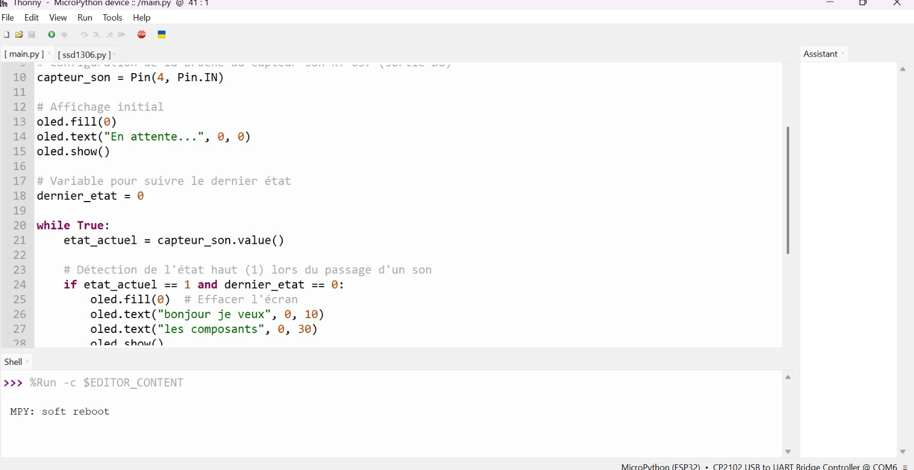
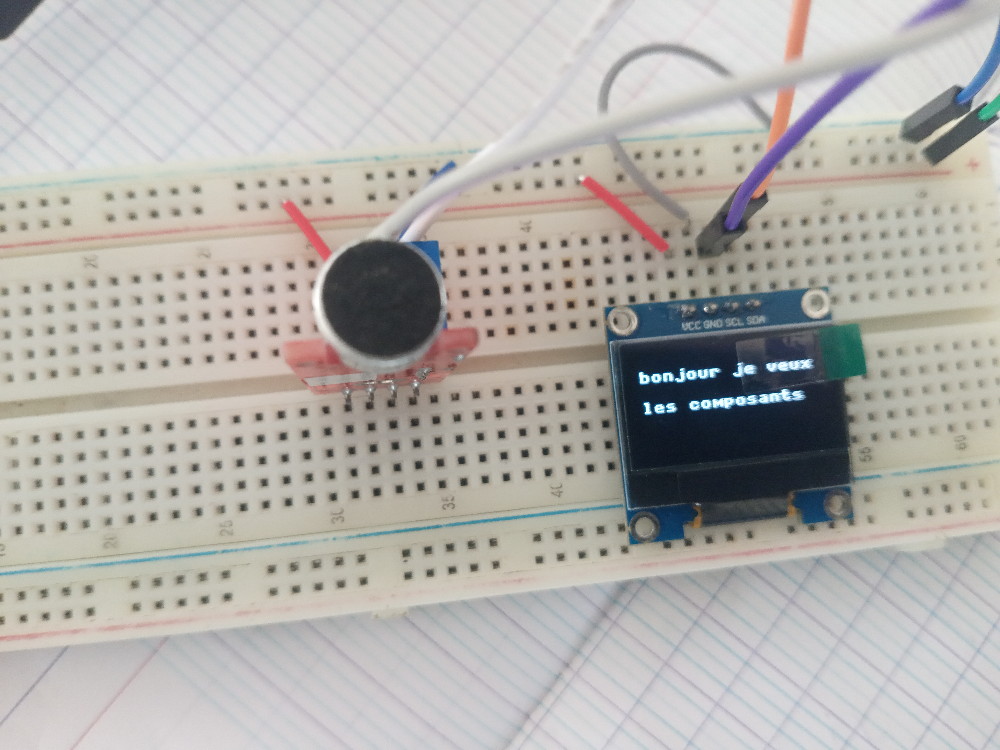

# Journal du 12 septembre 2026 (Redigé par : GNANZA Moussa)

## Fait aujourd'huit
- Contrôle de presence 
- se regroupé en groupe pour continuer le projet sous la suppervision des formateurs.
## appris
- faire  des rétouches sur la Modelisation du boitier  
- imprimer le boitier

- un exemple d'apperçu du cicuit imprimé
- programmation du code 

- code executé

 ## Echec , décidé
 