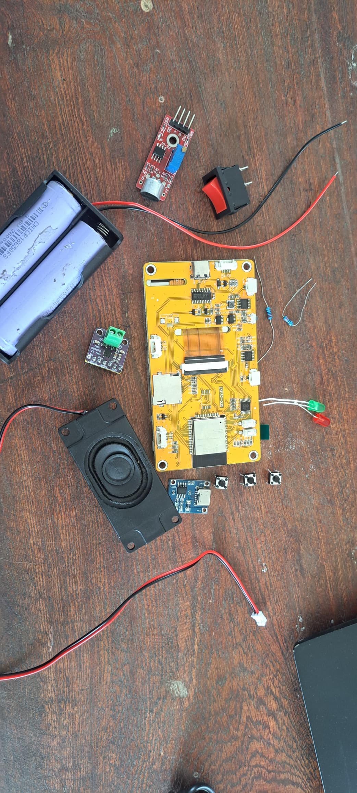
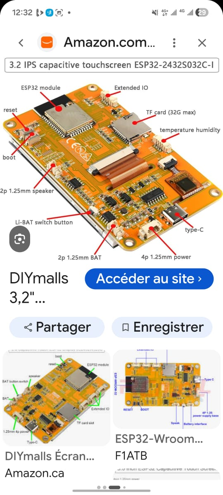
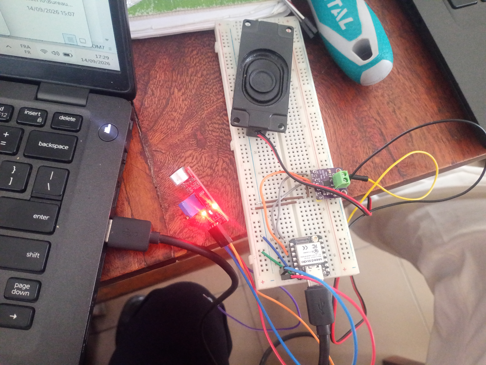
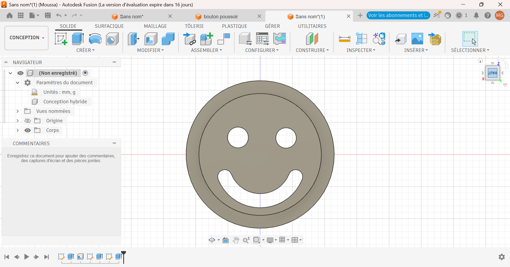
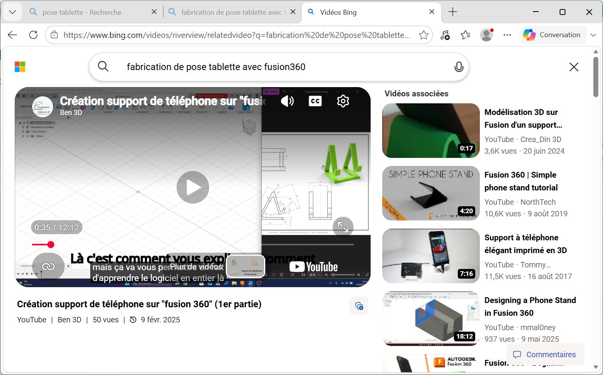
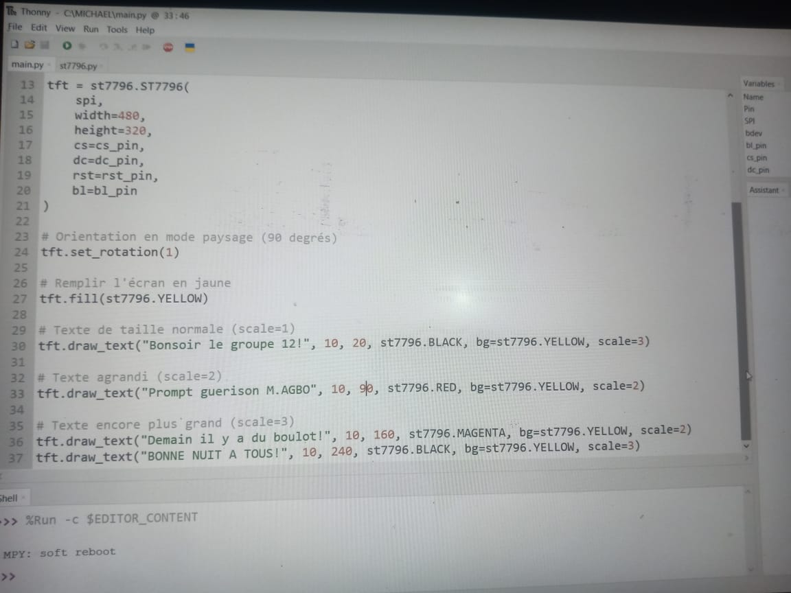
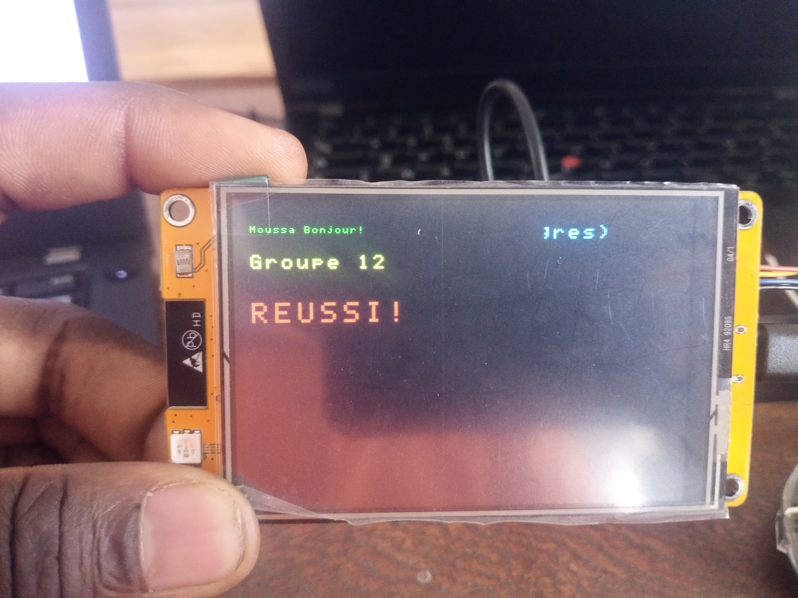

# Journal du 14 septembre 2026 (Redigé par : GNANZA Moussa)

## Fait aujourd'huit
- Contrôle de presence 
- se regroupé en groupe pour continuer le projet sous la suppervision des formateurs.
- on eut aussi quelques composants pour notre projet

- faire la recherche sur le branchement de differents composants.

- testé le haut parleur avec l'amplificateur. 

## appris
- faire la modélisation des couvre led en emoji

- faire des recherches sur la fabrication de pose boitier

- écrire un  code  pour tester l'ecran 

- Mesuré la difference de potenciel .

 ## Echec , décidé