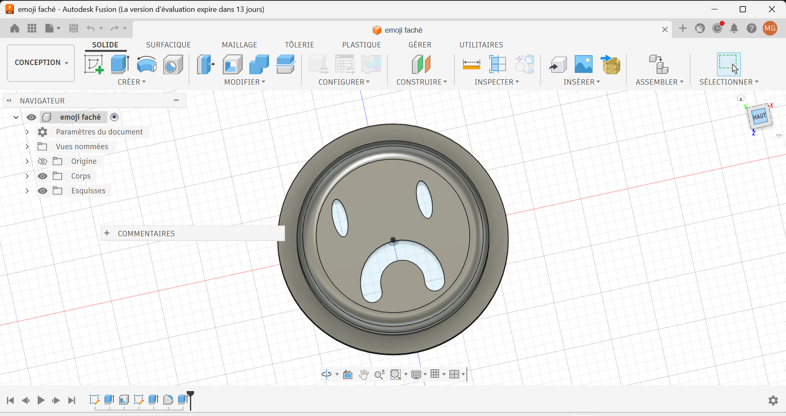

# Journal du 15 septembre 2026 (Redigé par : GNANZA Moussa)

## Fait aujourd'huit
- Contrôle de presence 
- se regroupé en groupe pour continuer le projet sous la suppervision des formateurs.
- faire la recherche sur le branchement de differents composants.
- testé le haut parleur avec l'amplificateur; le microphone l'ensemble du circuit.
## appris
- à faire le pose boitier
- Modelisé un emoji qui a rendu le visage sombre.

 ## Echec , décidé
 - Difficultés à faire fonctionner l'ensemble du circuit.
