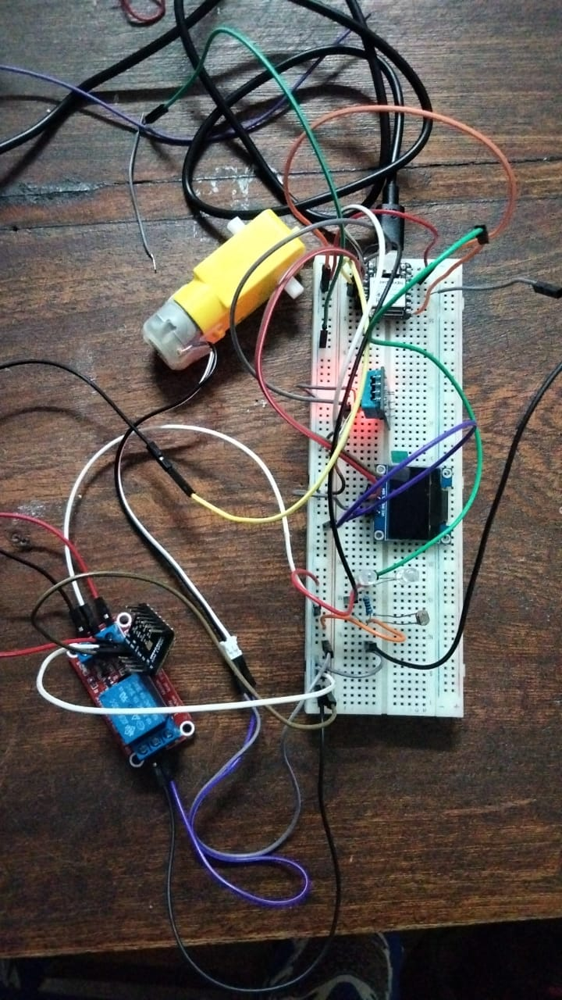
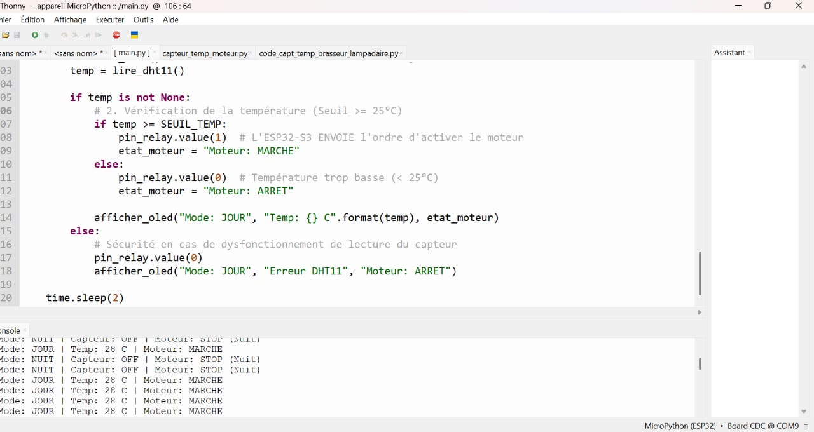
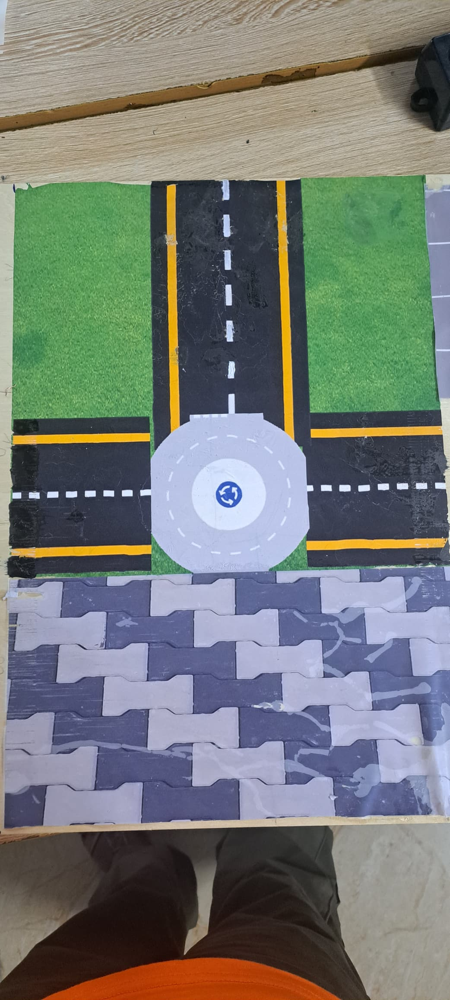

# Journal du 16 septembre 2026 (Redigé par : GNANZA Moussa)

## Fait aujourd'huit
- Nous avons continuer de travailler sur notre projet. Mais nous toujours rencontrer des difficultés. Sur ceux nous avons decidé de continuer à refléchir sur le projet tout en adoptant un  nouveau projet pour pouvoir presenter le vendredi. Le nouveau projet est:maquette d'un petit lycée scientifique moderne. 
- On s'est partagé les taches afin d'evoluer plus vite. 
- Moi et mr AFFO nous avons été designé pour faire la conception et la découpe  des salle de classe ; et une impression DTF pour le sol.Les autres membres font l'électronique et l'impression 3D 

## appris
- Faire le  DTF

- faire les maquettes de classe

 ## Echec , décidé
 - difficultés à flacher le code sur l'ESP32
 Nous avons decidé de continuer à reflechire sur le projet ; tout en adoptant un nouveau projet.