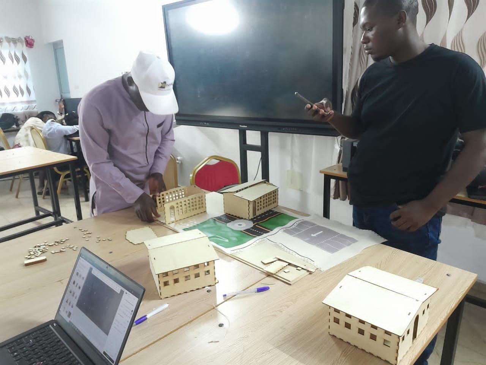
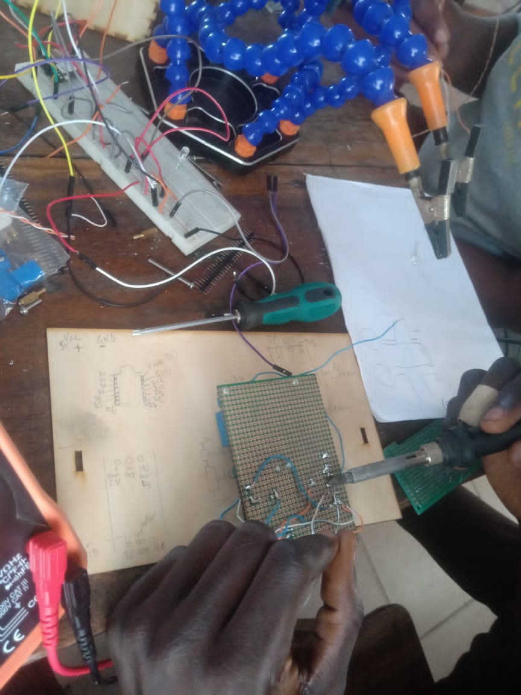
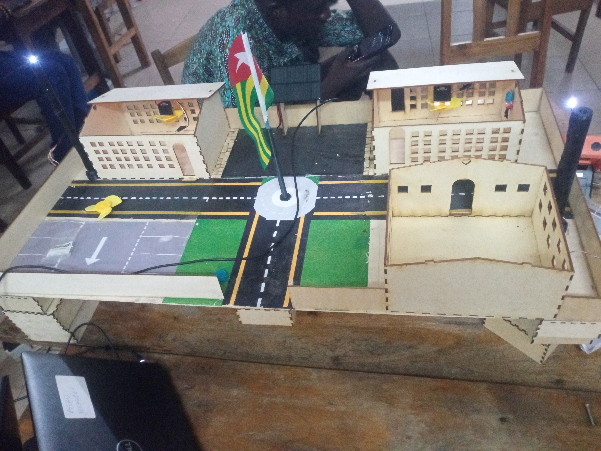
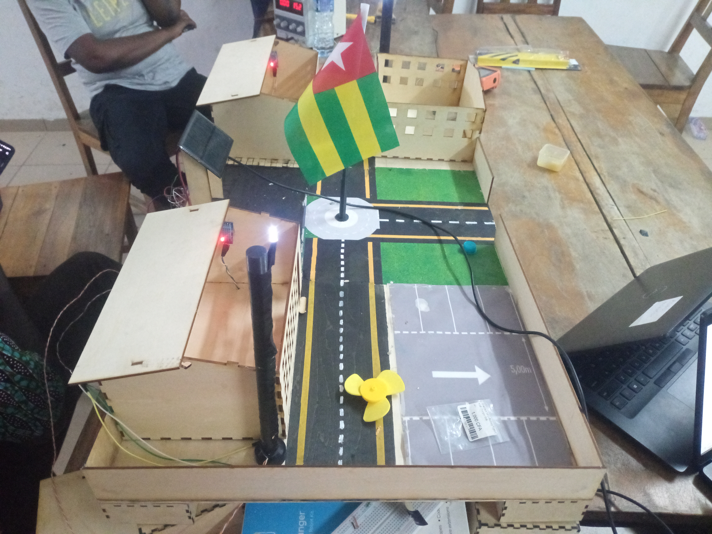

# Journal du 17 septembre 2026 (Redigé par : GNANZA Moussa)

## Fait aujourd'huit
- Contrôle de presence 
- Travailler sur le projet
- placer les maquettes de salle de classe

- faire le PCB 

- tester l'ensemble du projet. 

## appris
- j'ai apris que en cas de difficulté il  ne  faut jamais abandonné
 
 ## Echec , décidé
 
